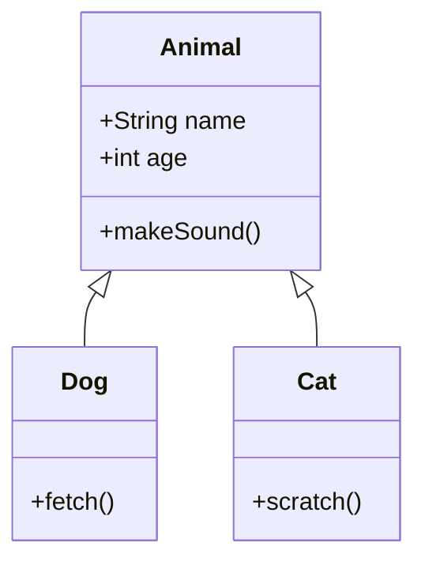
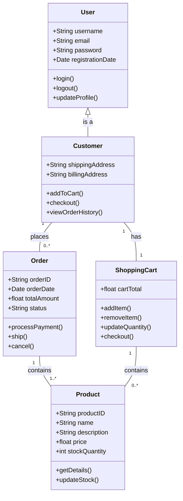

```mermaid
classDiagram
    class Animal {
        +String name
        +int age
        +makeSound()
    }
    class Dog {
        +fetch()
    }
    class Cat {
        +scratch()
    }
    Animal <|-- Dog
    Animal <|-- Cat
```

```mermaid
classDiagram
    class User {
        +String username
        +String email
        +String password
        +Date registrationDate
        +login()
        +logout()
        +updateProfile()
    }
    
    class Customer {
        +String shippingAddress
        +String billingAddress
        +addToCart()
        +checkout()
        +viewOrderHistory()
    }
    
    class Product {
        +String productID
        +String name
        +String description
        +float price
        +int stockQuantity
        +getDetails()
        +updateStock()
    }
    
    class Order {
        +String orderID
        +Date orderDate
        +float totalAmount
        +String status
        +processPayment()
        +ship()
        +cancel()
    }
    
    class ShoppingCart {
        +float cartTotal
        +addItem()
        +removeItem()
        +updateQuantity()
        +checkout()
    }
    
    User <|-- Customer : is a
    Customer "1" -- "1" ShoppingCart : has
    Customer "1" -- "0..*" Order : places
    Order "1" -- "1..*" Product : contains
    ShoppingCart "1" -- "0..*" Product : contains
```

